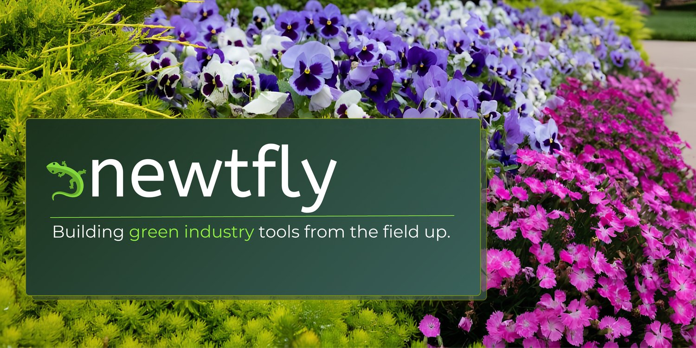

# Hi, I'm Dawnette.

I've spent years as an Account Manager in the green industry — walking properties, meeting crews, juggling customer expectations, and trying to make a dozen disconnected tools work in the field. At some point I stopped waiting for someone else to fix it.

Newtfly started the way most honest things do: with frustration. Field notes that never made it to the office. Customer context that lived in someone's head instead of the system. Irrigation settings across too many different platforms and too many clicks away. And software that was technically "built for the industry" — but either too bloated to be efficient or falling just short enough to be frustrating.

The result has always been the same: more clicks, more windows, more workarounds. Tools that make you adapt to them.

AI changes that. For the first time, it's genuinely possible to build lightweight, focused tools that adapt to the user — tools that fit the way a real day in this industry actually runs, without the bloat of a platform trying to be everything to everyone.

I'm not a developer by training. I'm a green industry Account Manager who got tired enough to learn. Everything I build gets tested against one question: does it actually bridge the gap — between irrigation platforms and crew notes, work tickets and customer calls, field photos and the CRM — or does it just add another thing to open?  It sincerely needs to keep up with you - in the field, in the office and everywhere the job actually lives.

That's the whole idea.

---

**Currently building:** Voice-first workflows, irrigation tools, and field automation — for the people who are too busy doing the work to fight with their software.

**Side Quest:** Designing bookshelf murals with custom book dust jackets, because apparently "free time" and "doing nothing" are concepts I've never quite figured out.

**Oklahoma City area**
